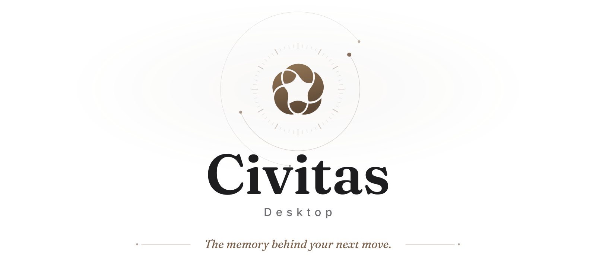
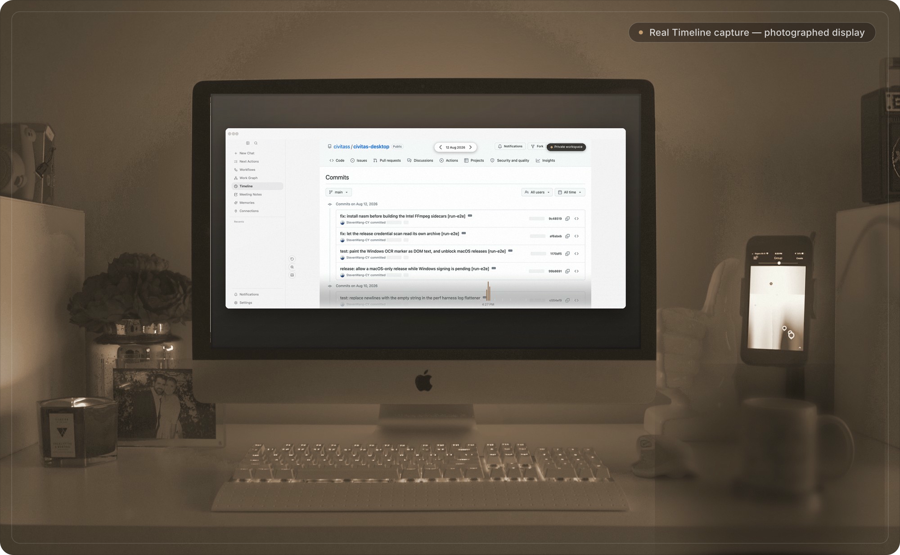
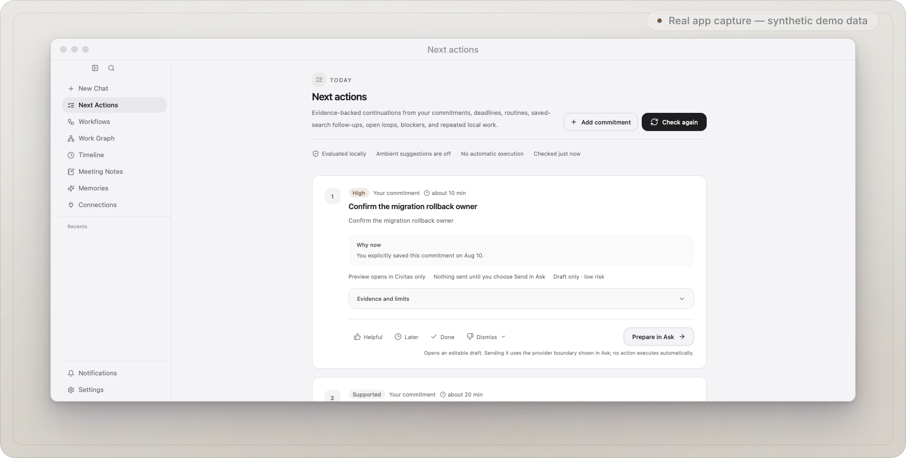
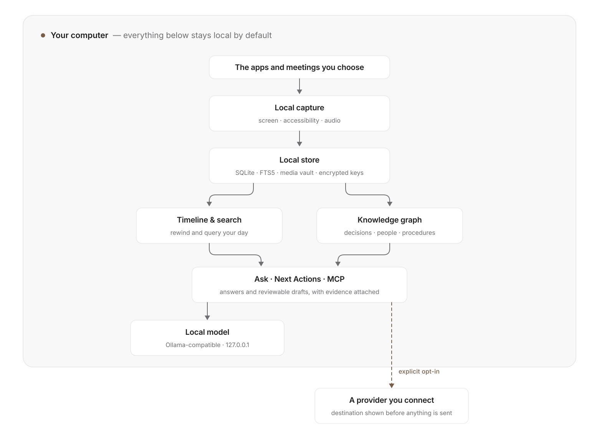
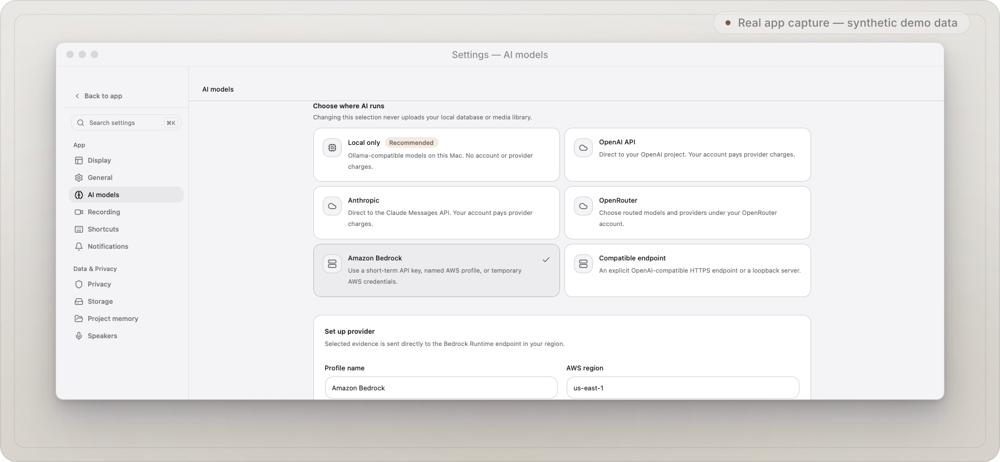

<p align="center">
  <picture>
    <source media="(prefers-color-scheme: dark)" srcset="docs/assets/readme/hero-dark.svg">
    
  </picture>
</p>

<h3 align="center">Remember the moment. Understand the why. Continue with confidence.</h3>

<p align="center">
  Civitas rewinds a private Timeline of your day, recovers why decisions were made,<br>
  and drafts evidence-linked next actions — all on your computer.
</p>

<p align="center">
  <a href="https://github.com/civitass/civitas-desktop/releases"><strong>Download</strong></a>
  &nbsp;·&nbsp;
  <a href="docs/BUILDING.md">Build from source</a>
  &nbsp;·&nbsp;
  <a href="docs/BYOK.md">Connect your AI</a>
  &nbsp;·&nbsp;
  <a href="docs/PRIVACY_AND_DATA_BOUNDARY.md">Privacy boundary</a>
</p>

<p align="center">
  <a href="LICENSE.md"></a>
  
  
  
</p>

<br>

<p align="center">
  <a href="docs/assets/demo/timeline.png">
    
  </a>
</p>

<p align="center"><sub><strong>Timeline</strong> — the real application replaying a deterministic, privacy-safe demo day, shown on a photographed display. Click for the unretouched capture. <em>Workspace photograph: DESIGNECOLOGIST, Unsplash.</em></sub></p>

## From the moment to the next move

| Remember | Understand | Continue |
| --- | --- | --- |
| Rewind the exact screen, app, meeting, or local transcript. | Reconstruct projects, people, decisions, reasons, blockers, and procedures in an evidence-linked graph. | Review ranked commitments and open loops with reason, evidence age, uncertainty, and safety state visible. |

Civitas is designed for one person recovering context across apps—not for
employee monitoring, fleet administration, or a company control plane. Capture,
search, Timeline, graph, feedback, and profile metadata stay on your computer by
default. AI is either loopback-local or a provider you explicitly connect.

<br>

<p align="center">
  <a href="docs/assets/demo/next-actions.png">
    
  </a>
</p>

<p align="center"><sub><strong>Next Actions</strong> — ranked continuations remain reviewable drafts; nothing executes by itself.</sub></p>

Every demo visual on this page is built from an unretouched capture of the
real desktop application. The publication E2E suite creates an isolated local
profile and deterministic synthetic content—never founder, contributor, or
customer data—then verifies the same user-visible surfaces before saving the
screenshots. Window chrome, backdrops, and the photographed display are
presentational; the interface pixels are the captures themselves, and every
shot links to its raw PNG.

## Three everyday wins

| When you need to… | Civitas helps you… | Without hiding… |
| --- | --- | --- |
| Recover a decision | Search across apps and time, then open the supporting local moment | the source, evidence age, or uncertainty |
| Re-enter a project | Reconstruct people, state changes, blockers, procedures, and reasons | where the graph inferred a relationship |
| Close open loops | Review ranked commitments and follow-ups in Next Actions | confidence, safety state, or your feedback controls |

## Start in three steps

1. If a signed version is present, download the verified macOS DMG — or the
   Windows installer, once a release covers it — from
   [GitHub Releases](https://github.com/civitass/civitas-desktop/releases).
   Otherwise, [build from source](docs/BUILDING.md).
2. Choose exactly what Civitas may capture. Screen and microphone permissions
   remain separate, and capture can be paused immediately from the tray.
3. Search locally first. If you want AI answers, add a local model or one of
   your own provider credentials under **Settings → AI**.

## What you can do

- **Remember the day.** Search screen text, accessibility context, and local
  transcripts across time, apps, projects, and people, with local multilingual
  OCR including explicit Simplified and Traditional Chinese support.
- **Predict the next move.** Pull a ranked set of evidence-backed commitments
  and open loops, inspect why each one appeared, and choose Done, Not now, or
  Dismiss. Suggestions never execute by themselves.
- **Ask with evidence.** Get an answer that separates direct evidence,
  synthesis, and uncertainty, with links back to the source.
- **See relationships.** Explore decisions and reasons, changing project state,
  recurring procedures, blockers, and contradictions in the knowledge graph.
- **Keep meeting context.** Detect meetings, create local notes, inspect
  transcripts, and export only what you choose.
- **Use your memory elsewhere.** Give a permissioned MCP client bounded,
  authenticated access to search and provenance-aware graph tools.

## The trust contract

| Promise | What the consumer build does |
| --- | --- |
| Local first | Capture, media, SQLite/FTS indexes, graph data, feedback, and provider profile metadata live under your local Civitas data directory. |
| Account-free | Capture, search, graph, export, deletion, local AI, and MCP do not require a Civitas login or subscription. |
| No hidden cloud | Railway, Supabase auth, Civitas-hosted AI credits, fleet, team sync, and enterprise policy are not part of the consumer runtime. |
| Bring your own model | Use loopback Ollama-compatible inference or connect OpenAI, Anthropic, OpenRouter, Bedrock, or a compatible endpoint. |
| Credentials stay protected | Persistent keys are encrypted with an OS-vault-backed key; an explicit session-only mode stays in process memory until quit. No plaintext fallback exists. |
| Capture is controllable | The tray shows capturing/paused/private state and provides immediate, timed, and indefinite pause controls. Clipboard and raw typed-text persistence are off by default. |
| Suggestions are drafts | Next Actions exposes evidence, confidence, safety state, and feedback controls. It cannot auto-execute. |

> [!IMPORTANT]
> A remote AI provider receives the prompt and selected evidence for requests
> made with that profile. Civitas shows the exact destination and requires a
> data-boundary acknowledgement before activation. Provider terms, retention,
> routing, and charges apply. See [Bring your own AI](docs/BYOK.md).

## How it works

<p align="center">
  <picture>
    <source media="(prefers-color-scheme: dark)" srcset="docs/assets/readme/how-it-works-dark.svg">
    
  </picture>
</p>

The desktop app and engine run on the user's computer. The engine binds its
authenticated API to `127.0.0.1:3030`; there is no LAN setting or service
discovery. Local capture and lexical query work without an AI provider.

When an AI feature runs, the loopback inference gateway loads the active
profile and credential in Rust. Official provider profiles pin the provider
host, reject redirects and URL credentials, and record only bounded technical
request metadata—not prompt content—in the local audit table.

## Next Actions, rebuilt for trust

The earlier predictive-action concept was recovered from repository history and
adapted to the current local architecture as a pull-based feature.

Candidates come from grounded local signals such as explicit commitments,
unresolved blockers, owner-enabled saved-search follow-ups, decision
follow-ups, recent task-like evidence, and stale open loops. Saved-search
follow-ups are opt-in, interval-bounded, and reopen the exact local query and
filters. The ranker considers evidence strength, recency, confidence,
duplication, feedback, cooldowns, and ambiguity. It suppresses expired,
unsupported, sensitive, or high-risk candidates.

Every visible card can show:

- the proposed action and why it matters;
- the local evidence and its age;
- confidence and uncertainty;
- safety/approval state;
- Done, Not now, and Dismiss feedback.

No suggestion sends a message, edits a file, opens a browser, or invokes an
integration automatically.

## Choose where AI runs

| Choice | Credential | Destination | Useful when |
| --- | --- | --- | --- |
| Local loopback | None | `127.0.0.1` / `localhost` | You want prompts and evidence to remain on the computer |
| OpenAI API | Project API key | `api.openai.com` | Your OpenAI API project provides the models/capabilities you need |
| Anthropic | Anthropic API key | `api.anthropic.com` | You want direct Claude Messages API access |
| OpenRouter | OpenRouter API key | `openrouter.ai` and the chosen upstream route | You want a routed model catalog |
| Amazon Bedrock | Short-term key, AWS profile, or temporary access keys | Region-pinned Bedrock Runtime | You manage models and access in AWS |
| Compatible endpoint | Optional API key | Exact HTTPS or loopback host shown in Settings | You operate a trusted OpenAI-compatible server |

<br>

<p align="center">
  <a href="docs/assets/demo/ai-providers.png">
    
  </a>
</p>

<p align="center"><sub><strong>Settings → AI</strong> — choose the boundary first; add a credential only when a remote provider is intentional.</sub></p>

The app provides save, replace, test, activate, and delete flows. Diagnostics
use the fixed prompt `Reply with OK.` and never return the credential.
[Provider setup](docs/BYOK.md) and the
[capability catalog](docs/MODEL_CATALOG.md) document the exact contract.

Conversational Ask and Chat additionally use an optional local assistant
runtime. It is absent on first launch: opening the app or Chat never downloads
it. **Settings → AI** shows its exact package/version, registry destination,
data boundary, and storage location before an explicit **Install runtime**
action. Civitas installs from its reviewed frozen lockfile with the bundled Bun
sidecar and disabled lifecycle scripts; it never falls back to system npm or a
global agent. Core capture, search, graph, export, and MCP features do not need
this runtime. The same card can stop active assistant sessions and remove the
managed packages without deleting work data, provider profiles, or credentials.

## Install on macOS

1. Open [GitHub Releases](https://github.com/civitass/civitas-desktop/releases).
2. Download the DMG for Apple Silicon or Intel and its checksum manifest.
3. Verify the checksum, Developer ID signature, notarization ticket, and GitHub
   provenance using [Release verification](docs/RELEASE_VERIFICATION.md).
4. Drag Civitas Desktop to Applications.
5. Grant only the capture permissions you intend to use.
6. Start with Local only, or add a provider in **Settings → AI**.

Official automation builds, signs, notarizes, staples, installs, verifies, and
attaches every artifact to a protected draft. It publishes that draft only
after the exact-commit CI, code signatures for every platform in the release,
notarization, updater signatures, checksums, SBOM, provenance, and isolated
installation gates all pass. A missing credential or failed gate leaves no
advertised release for that platform.

## Install on Windows

Windows binaries ship once Authenticode signing credentials are configured;
until then a release covers macOS only and you can
[build from source](docs/BUILDING.md). Check the release assets for the
platforms a given version actually covers.

1. Open [GitHub Releases](https://github.com/civitass/civitas-desktop/releases).
2. Download `Civitas-Desktop_<version>_x64-setup.exe` and `SHA256SUMS`.
3. Verify the checksum, GitHub provenance, and Authenticode publisher using
   [Release verification](docs/RELEASE_VERIFICATION.md).
4. Run the installer. Windows 10 22H2 or later and Windows 11 are supported on
   x86-64 computers.
5. Grant only the capture permissions you intend to use, then choose Local AI
   or add your own provider in **Settings → AI**.

The official Windows artifact is release-blocked unless both the application
and installer have a valid timestamped Authenticode signature. Civitas does
not publish an unsigned package as an official release, and does not hold the
verified macOS artifacts back while Windows signing is pending — see
[Release verification](docs/RELEASE_VERIFICATION.md) for how each release
records the platforms it covers.

## Build from source

The repository pins Rust `1.93.1` and Bun `1.3.10`.

```bash
git clone https://github.com/civitass/civitas-desktop.git
cd civitas-desktop

cargo build --locked

cd apps/civitas-app-tauri
bun install --frozen-lockfile
bun run tauri dev
```

An optimized local bundle:

```bash
cd apps/civitas-app-tauri
bun run tauri build
```

Platform prerequisites, feature flags, generated bindings, and release-vs-source
differences are in [Building](docs/BUILDING.md).

## Connect an MCP client

The safest setup is **Settings → Connections**, where Civitas can write a
client configuration with the exact package version and a dedicated,
server-enforced read-only credential. The device-owner API key is never copied
to an MCP client.

The configuration copied by Civitas has this shape:

```json
{
  "mcpServers": {
    "civitas": {
      "command": "npx",
      "args": ["-y", "civitas-mcp@0.18.10"],
      "env": {
        "CIVITAS_MCP_CREDENTIAL": "<issued-by-civitas>",
        "CIVITAS_MCP_SCOPES": "read"
      }
    }
  }
}
```

Use the in-app copy action rather than substituting the device-owner key
manually. Client credentials expire after 90 days by default and can be
inspected, rotated, or revoked under **AI client access**. Do not commit the
credential. MCP results enter the connected client and may be sent to that
client's model provider. The full scope and transport model is in [Civitas
MCP](packages/civitas-mcp/README.md).

## Architecture

| Layer | Main code | Responsibility |
| --- | --- | --- |
| Desktop | `apps/civitas-app-tauri` | Tauri v2, Next.js, onboarding, capture controls, Ask, graph, timeline, provider and connection settings |
| Engine/API | `crates/civitas-engine` | Loopback Axum API, capture orchestration, retrieval, inference gateway, graph workers, Next Actions |
| Screen/accessibility | `crates/civitas-screen`, `crates/civitas-a11y`, `crates/civitas-capture` | Event-driven local context capture |
| Audio | `crates/civitas-audio` | Local devices, VAD, transcription adapters, speaker/meeting pipeline |
| Storage | `crates/civitas-db`, `crates/civitas-vault`, `crates/civitas-secrets` | SQLite/FTS, media vault, encrypted credentials |
| Knowledge | `crates/civitas-mining` and engine graph workers | Episodes, entities, claims, decisions, procedures, provenance, resolution |
| Connections | `crates/civitas-connect` | Optional vault-backed local/personal integrations and safe local proxies |
| MCP | `packages/civitas-mcp` | Scoped bridge from trusted MCP clients to the authenticated loopback API |

Key local endpoints include:

```text
GET  /search
GET  /activity-summary
GET  /kg/entities/:name
GET  /kg/decisions
GET  /kg/procedures
GET  /kg/blockers
POST /kg/precedents
GET  /next-actions
POST /next-actions/feedback
GET  /next-actions/quality
POST /v1/chat/completions
GET  /health
```

Use the reviewed [checked-in OpenAPI snapshot](docs/openapi.yaml) when building
an integration. A running engine also serves its generated description at
`http://127.0.0.1:3030/openapi.yaml`. Live requests require the local bearer
credential. Authentication cannot be disabled in the consumer build.

## Privacy and security

- [Privacy policy](PRIVACY.md)
- [Privacy and data boundary](docs/PRIVACY_AND_DATA_BOUNDARY.md)
- [Portable data ownership](docs/PORTABLE_DATA.md)
- [Network boundary](docs/NETWORK_BOUNDARY.md)
- [Threat model](docs/THREAT_MODEL.md)
- [Security policy](SECURITY.md)
- [Release verification](docs/RELEASE_VERIFICATION.md)

For a stricter local session, pre-stage local models and launch with
`CIVITAS_NETWORK_MODE=deny`. This blocks reviewed remote inference, optional
product analytics, model downloads, and update paths. Crash diagnostics are
local files and are never uploaded automatically. Network-deny mode is not a
substitute for an OS firewall; the network document explains the remaining
explicit integration boundaries.

## Documentation

- [Building from source](docs/BUILDING.md)
- [Bring your own AI provider](docs/BYOK.md)
- [Model and capability catalog](docs/MODEL_CATALOG.md)
- [Local multilingual OCR](docs/OCR.md)
- [Local search and saved queries](docs/SEARCH.md)
- [Knowledge quality and performance evaluation](docs/QUALITY_EVALUATION.md)
- [Roadmap](ROADMAP.md)
- [Governance](GOVERNANCE.md)
- [Contributing](CONTRIBUTING.md)
- [Support](SUPPORT.md)
- [Testing](TESTING.md)
- [Consumer publication and release gates](docs/publication/PUBLICATION_PLAN.md)
- [Architecture decisions](docs/adr/)

## Project principles

1. Evidence before fluency.
2. Abstain when personal history does not support an answer.
3. Local and visible before remote and ambient.
4. Permission is specific, revocable, and never inferred from captured text.
5. A suggestion is a draft until the user acts.
6. Privacy/security regressions block release.

## Contributing

Privacy bugs, groundedness failures, accessible interaction improvements, local
model support, retrieval quality, and careful platform testing are especially
welcome. Read [CONTRIBUTING.md](CONTRIBUTING.md) and
[CODE_OF_CONDUCT.md](CODE_OF_CONDUCT.md) before opening a change.

For vulnerabilities, do not open a public issue; follow [SECURITY.md](SECURITY.md).

## Contributors

Civitas is shaped by [Chuyue Wang and Eric Bi](CONTRIBUTORS.md), alongside the
open-source work acknowledged in [NOTICE.md](NOTICE.md).

<br>

<p align="center">
  <picture>
    <source media="(prefers-color-scheme: dark)" srcset="docs/assets/readme/mark-dark.svg">
    
  </picture>
</p>

<p align="center">
  <sub>Local first · account-free · bring your own model</sub>
</p>
